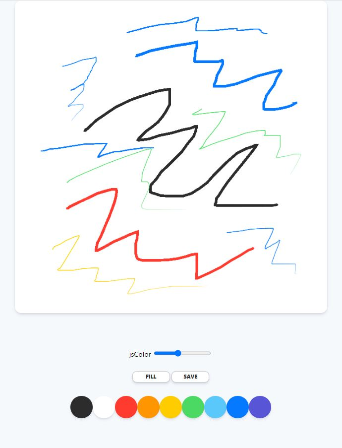
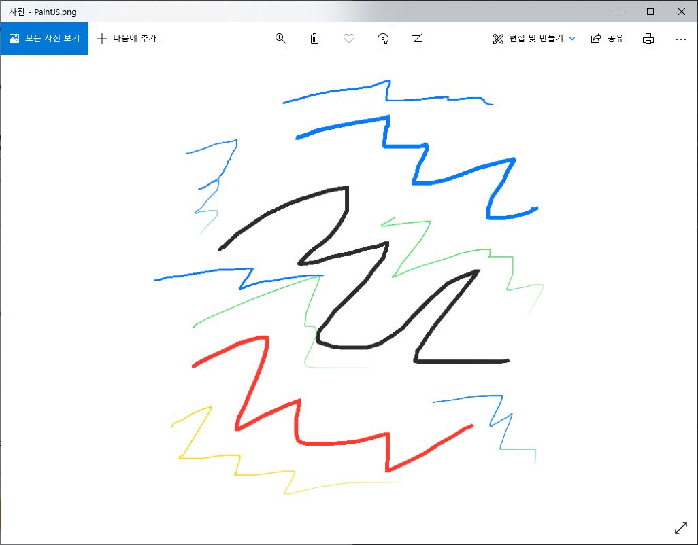

# Javascript 그림판
VanillaJS로 구현한 그림판

```json
{
    "name":"Javascript for Beginners 2",
    "packages": [
        "Javascript",
        "Canvas",
        "2D Context",
        "Pointer Events"
    ]
}
```

## 기능
- HTML5 Canvas
- Mouse Events
- 2D Context
- 2D Painting
- Brush Size
- Image Saving

## 스크린샷



